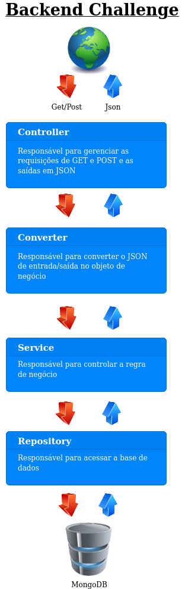

## Backend Challenge

Serviço API REST criado em Spring Boot que serve para criar um determinado filme e retornar os filmes de acordo com o nível de censura (CENSURADO e SEM_CENSURA). Foi utilizado o MongoDB como banco de dados.

Para os contratos de entrada e saída foram criadas as seguintes camadas:
- `Request` - entrada
- `Response` - saída

Foi criada uma interface para fazer as transformações de objetos, onde é necessário fazer uma implementação para cada objeto que deseja transformá-lo.

Na busca de filmes foi implementada a ordenação pelo campo nome do filme em ordem alfabética. Além disso, incluímos a paginação desse resultado de busca.

Para checar se existe o filme, foi implementado para buscar o nome do filme de qualquer forma, com isso não temos o problema de pesquisar o mesmo filme porém com letras maiúsculas, minúsculas, espaços à esquerda ou espaços à direita.

Foi utilizado o `MongoAuditing` para incluir a data que o filme foi inserido no banco de dados. Poderia ter usado mais funções, como `@LastModifiedDate`, `@CreatedBy`, `@Version` por exemplo.

Foram utilizados os frameworks `Consul` e `Vault` para garantir uma flexibilidade e segurança para a aplicação, onde é possível gerenciar propriedades sensíveis e não sensíveis sem a necessidade de um deploy.
- `Consul` - propriedades não sensíveis  
- `Vault` - propriedades sensíveis (as informações são criptografadas)

Para visualizar as propriedades não sensíveis criadas, basta acessar [Consul](http://localhost:8500/)
 
As configurações do `Consul`, `Vault` e `Mongo` foram feitas através do arquivo `docker-compose`.

Existe o arquivo `data/consul/data.json` contendo as configurações iniciais das propriedades do `Consul`, nele é definido as chaves e os seus respectivos valores.

Para as respostas da API foram feitos tratamentos de erro para retornarem códigos de erros claros e descritivos.


## Stack

| Nome | Descrição  |
|------|------------|
| [Linux Mint 19.3 Cinnamon](https://www.linuxmint.com/) | Sistema Operacional |
| [IntelliJ IDEA](https://www.jetbrains.com/idea/) | IDE de desenvolvimento |
| [Java 11](https://www.java.com/pt_BR/) | Linguagem de programação |
| [Spring Boot 2.1.12](https://spring.io/projects/spring-boot) | Framework para subir a aplicação |
| [Spring Data MongoDB](https://spring.io/projects/spring-data) | Framework para manipulação de banco de dados |
| [Spring Configuration Processor](https://docs.spring.io/spring-boot/docs/2.1.12.RELEASE/reference/htmlsingle/#configuration-metadata-annotation-processor) | Framework que é um processador de anotação que gera metadados sobre as classes |
| [MongoDB](https://www.mongodb.com/) | Banco de dados NoSQL |
| [NoSQLBooster for MongoDB](https://nosqlbooster.com/) | IDE para acessar o banco de dados Mongo |
| [Consul](https://www.consul.io/) | Gestão de propriedades não sensíveis da aplicação |
| [Vault](https://www.vaultproject.io/) | Gestão de propriedades sensíveis da aplicação |
| [Spring Actuator](https://spring.io) | Framework para monitoramento da aplicação |
| [Lombok](https://projectlombok.org/) | Framework focado em produtividade e redução de código boilerplate |
| [SpringFox](http://springfox.github.io/springfox/) | Framework para fornecer anotações para gerar documentação do Swagger |
| [Apache Maven](https://maven.apache.org/) | Gestão de dependências no projeto |
| [JUnit](https://junit.org/) | Biblioteca para testes |
| [Embedded MongoDB Database](https://flapdoodle-oss.github.io/de.flapdoodle.embed.mongo/) | Fornece uma maneira neutra de plataforma para executar o MongoDB em testes |
| [AssertJ](http://joel-costigliola.github.io/assertj/) | Asserções customizadas em testes |
| [Mockito](https://site.mockito.org/) | Framework de mocking para uso em testes |
| [Fixture Factory](https://github.com/six2six/fixture-factory) | Biblioteca para geração de fixtures de teste |
| [Jacoco](https://www.eclemma.org/jacoco/trunk/doc/maven.html) | Biblioteca para análise de cobertura de código |


## Arquitetura

Diagrama para ilustrar a arquitetura básica utilizada na aplicação:



Segue abaixo como foi criada a arquitetura da aplicação:

 + **Config:** Classes de configuração da aplicação
 + **Controller**
    - **Request:** Objetos de entrada
    - **Response:** Objetos de saída
    - **Transformer:** Classes de transformação dos objetos de entrada para os objetos de negócio e dos objetos de negócio para objetos de saída
 + **Exceptions:** Exceptions de negócio
 + **Model:** Entidades e domínios
 + **Repository:** Interface de acesso ao MongoDB
 + **Service:** Implementação das regras de negócio


## Executar a aplicação

Para executar a aplicação precisamos:
- [Java 11](https://www.java.com/pt_BR/)
- [Maven](https://maven.apache.org/)
- [Docker](https://www.docker.com/)

#### Como executar

* Baixar o projeto do Git para um diretório desejado

* Acessar o diretório e gerar o pacote `jar` com o `mvn`:

```sh
$ mvn clean package
```

* Feito o passo acima, executar o `docker-compose` para subir a aplicação:

```sh
$ docker-compose up --build -d
```
**Observação:** Talvez seja importante limpar as redes locais do docker (```docker network prune -f```), pois pode ocorrer conflito ao subir a aplicação! A aplicação está utilizando a seguinte rede: ```subnet: 172.20.100.0/24``` e ```gateway: 172.20.100.1``` (configuração está no arquivo `docker-compose.yml`)

* Ao concluir a parte do docker, a aplicação estará disponível na porta 8080 e com isso será possível acessar o [Swagger UI](http://localhost:8080/swagger-ui.html). *Se preferir, coloquei mais abaixo alguns exemplos de cUrl e Json.*

* Caso queira parar a aplicação e todas as suas dependências, basta executar o comando:

```sh
$ docker-compose down
```


## Exemplos

Caso não queira usar o Swagger, seguem abaixo alguns cenários para teste usando cUrl:

* Inserir um filme corretamente (`201 - Created`)
```
curl -X POST 
  http://localhost:8080/movies
  -H 'Content-Type: application/json;charset=UTF-8'
  -d '{
	"cast": [
     {
       "name": "Paul Walker"
     },
     {
       "name": "Vin Diesel"
     }
   ],
   "censorshipLevel": "SEM_CENSURA",
   "director": "Rob Cohen",
   "name": "Velozes e Furiosos",
   "releaseDate": "2001-06-22"
 }'
```

* Caso execute o cUrl acima pela segunda vez, será retornado `400 - BAD REQUEST` informando que o nome do filme já existe

* Erro ao inserir o filme pois passou o limite de 10 atores no elenco (`400 - BAD REQUEST`)
```
curl -X POST
  http://localhost:8080/movies
  -H 'Content-Type: application/json;charset=UTF-8'
  -d '{
	"cast": [
     {
       "name": "Paul Walker"
     },
     {
       "name": "Vin Diesel"
     },
     {
       "name": "Michelle Rodriguez"
     },
     {
       "name": "Jordana Brewster"
     },
     {
       "name": "Rick Yune"
     },
     {
       "name": "Chad Lindberg"
     },
     {
       "name": "Johnny Strong "
     },
     {
       "name": "Matt Schulze"
     },
     {
       "name": "Ted Levine"
     },
     {
       "name": "Ja Rule"
     },
     {
       "name": "Vyto Ruginis"
     }
   ],
   "censorshipLevel": "SEM_CENSURA",
   "director": "Rob Cohen",
   "name": "Velozes e Furiosos 2",
   "releaseDate": "2001-06-22"
 }'
```

* Erro ao inserir pois não foi passado o nível de censura (`400 - BAD REQUEST`)
```
curl -X POST 
  http://localhost:8080/movies
  -H 'Content-Type: application/json;charset=UTF-8'
  -d '{
	"cast": [
     {
       "name": "Paul Walker"
     },
     {
       "name": "Vin Diesel"
     }
   ],
   "director": "Rob Cohen",
   "name": "Velozes e Furiosos",
   "releaseDate": "2001-06-22"
 }'
```

* Busca os filmes com nível de censura `SEM_CENSURA` e por não passar os parâmetros `PAGE` e `SIZE`, a aplicação retorna sem limite de página ou itens:
```
curl -X GET
  'http://localhost:8080/movies?censorshipLevel=SEM_CENSURA'
  -H 'Accept: application/json'
```

* Busca os filmes com nível de censura `SEM_CENSURA` e retorna 1 registro da página 1 (caso tenha 1 registro na base de dados):
```
curl -X GET
  'http://localhost:8080/movies?censorshipLevel=SEM_CENSURA&page=1&size=1'
  -H 'Accept: application/json'
```

* Busca os filmes com nível de censura `SEM_CENSURA` e retorna 1 registro da página 2 (caso tenha 2 registros na base de dados):
```
curl -X GET
  'http://localhost:8080/movies?censorshipLevel=SEM_CENSURA&page=2&size=1'
  -H 'Accept: application/json'
```

* Erro buscar os filmes por não passar o parâmetro `censorshipLevel` (`400 - BAD REQUEST`):
```
curl -X GET
  http://localhost:8080/movies
  -H 'Accept: application/json'
``` 

* Erro buscar os filmes por deixar o parâmetro `censorshipLevel` em branco (`400 - BAD REQUEST`):
```
curl -X GET
  'http://localhost:8080/movies?censorshipLevel='
  -H 'Accept: application/json'
``` 

* Erro buscar os filmes por passar um valor diferente de `SEM_CENSURA` e `CENSURADO` no parâmetro `censorshipLevel` (`400 - BAD REQUEST`):
```
curl -X GET
  'http://localhost:8080/movies?censorshipLevel=XXX'
  -H 'Accept: application/json'
```

## Request de Entrada

* JSON utilizado para inserir um filme:
```
{
	"cast": [
     {
       "name": "Paul Walker"
     },
     {
       "name": "Vin Diesel"
     }
   ],
   "censorshipLevel": "SEM_CENSURA",
   "director": "Rob Cohen",
   "name": "Velozes e Furiosos",
   "releaseDate": "2001-06-22"
}
```

## Request de saída

* JSON que é retornado ao inserir um filme com sucesso:
```
{
    "id": "5e9e76ca4945c74423806ddb",
    "name": "Velozes e Furiosos",
    "releaseDate": "2001-06-22",
    "censorshipLevel": "SEM_CENSURA",
    "director": "Rob Cohen",
    "cast": [
        {
            "name": "Paul Walker"
        },
        {
            "name": "Vin Diesel"
        }
    ],
    "createdDate": "2020-04-21T01:30:02.617481"
}
```

* JSON que é retornado ao buscar filmes com nível de censura `SEM_CENSURA` sem limite de página e registros:
```
{
    "content": [
        {
            "id": "5e9e6eeb4945c740fe0dcd53",
            "name": "Velozes e Furiosos",
            "releaseDate": "2001-06-22",
            "censorshipLevel": "SEM_CENSURA",
            "director": "Rob Cohen",
            "cast": [
                {
                    "name": "Paul Walker"
                },
                {
                    "name": "Vin Diesel"
                }
            ],
            "createdDate": "2020-04-21T00:56:27.389"
        },
        {
            "id": "5e9e6f814945c740fe0dcd54",
            "name": "Velozes e Furiosos 2",
            "releaseDate": "2001-06-22",
            "censorshipLevel": "SEM_CENSURA",
            "director": "Rob Cohen",
            "cast": [
                {
                    "name": "Paul Walker"
                },
                {
                    "name": "Vin Diesel"
                },
                {
                    "name": "Michelle Rodriguez"
                },
                {
                    "name": "Jordana Brewster"
                },
                {
                    "name": "Rick Yune"
                },
                {
                    "name": "Chad Lindberg"
                },
                {
                    "name": "Johnny Strong "
                },
                {
                    "name": "Matt Schulze"
                }
            ],
            "createdDate": "2020-04-21T00:58:57.961"
        }
    ],
    "pageable": "INSTANCE",
    "last": true,
    "totalPages": 1,
    "totalElements": 2,
    "number": 0,
    "sort": {
        "sorted": false,
        "unsorted": true,
        "empty": true
    },
    "size": 2,
    "first": true,
    "numberOfElements": 2,
    "empty": false
}
```

* JSON que é retornado ao buscar filmes com nível de censura `SEM_CENSURA` na página 2 e com 1 registro:
```
{
    "content": [
        {
            "id": "5e9e6f814945c740fe0dcd54",
            "name": "Velozes e Furiosos 2",
            "releaseDate": "2001-06-22",
            "censorshipLevel": "SEM_CENSURA",
            "director": "Rob Cohen",
            "cast": [
                {
                    "name": "Paul Walker"
                },
                {
                    "name": "Vin Diesel"
                },
                {
                    "name": "Michelle Rodriguez"
                },
                {
                    "name": "Jordana Brewster"
                },
                {
                    "name": "Rick Yune"
                },
                {
                    "name": "Chad Lindberg"
                },
                {
                    "name": "Johnny Strong "
                },
                {
                    "name": "Matt Schulze"
                }
            ],
            "createdDate": "2020-04-21T00:58:57.961"
        }
    ],
    "pageable": {
        "sort": {
            "sorted": false,
            "unsorted": true,
            "empty": true
        },
        "offset": 1,
        "pageSize": 1,
        "pageNumber": 1,
        "paged": true,
        "unpaged": false
    },
    "last": true,
    "totalPages": 2,
    "totalElements": 2,
    "number": 1,
    "sort": {
        "sorted": false,
        "unsorted": true,
        "empty": true
    },
    "size": 1,
    "first": false,
    "numberOfElements": 1,
    "empty": false
}
```

## Cobertura de testes

- A cobertura de testes foram focadas na parte de negócio, onde se faz necessário para garantir a integridade da aplicação.
- A cobertura de testes foram feitas em 100% de linhas, métodos e branches para todas as classes testadas.
- As validações das regras do objeto request foram feitas com Bean Validation.
- Foram feitos testes da interface Repository do Mongo para validar a manipulação das informações na base de dados.

## Classes não testadas
Os seguintes pacotes não foram testados:
- `exception`
- `config`
- `model`
- `controller/request`
- `controller/response`

O seguinte arquivo não foi testado:
- `BackendChallengeApplication`

## Implementações futuras

Colocarei abaixo possíveis implementações para serem feitas no futuro:

* Criar a funcionalidade de buscar um filme pelo ID
* Criar a funcionalidade de alterar um filme
* Criar a funcionalidade de excluir um filme (seja por exclusão lógica ou física)
* Criar a funcionalidade de buscar filmes com mais critérios de busca
* Incluir o campo de quem criou o registro
* Incluir o campo de quem alterou o registro
* Incluir o campo da última alteração do registro
* Incluir a versão do registro na base de dados
* No momento de inserir o filme, ao invés de utilizar o método `existsByName` para checar se já existe, trocar para tratar a exceção `DuplicateKeyException`, com isso você acaba fazendo um acesso a menos na base de dados
* Implementar cache para deixar a busca de filmes mais rápidas

